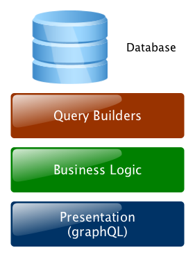

# BAM API

A GraphQL, "production ready"™ api for internal use at bam, but open sourced as an example !

## Foreword

Finding great ressources on the client side graphql is pretty easy, for instance, for apollo, there is https://www.learnapollo.com/.

Finding great ressources on the server side is way more difficult. GraphQL is only a spec and there is litterally at least 20 differents languages implementations.

That being said using the project as a boilerplate to start simple project with GraphQL may be less preagmatic than using great SASS, like https://www.graph.cool/ !

## Goals

The goals of this repo are:
- to have a graphql api that can be used as a reference for existing and new graphql project,
- to have a graphql api that show some "production ready"™ tricks, that are not easy to find on the web (for instance oauth authentication and access control),
- to investigate the devlopment tooling around graphql apis (flow, eslint ect),
- to investigate good way to put containers on production (docker, maybe kubernetes ^^),
- to have a centralized api to start cool project at bam, like internal tools and so !

Non goals of this repo are:
- to be minimalist
- to be a boilerplate generator for the forseable future (that being said, we might extract our `create-graphql-api` app from this later on)

## Repository stucture

We organized the sever using the following layer



### Database

All the file related are either:
- the `knexfile.js` at the root of the directory, used for knex command line
- in the `db` folder

The database layer are the `db/migrations/*.js` and `db/seed/*.js` files. Migrations are common for traditional RDBMs. I personnaly think they offer a extra security by providinf incremental, reversible and documented changes.

We use the http://knexjs.org/ query builder to write and execute the mutations.

###  Query Builders

We then have Query Builders in the `db/queryBuilders` directory.

Query builders provide a domain driven abstrction to raw sql calls.

Considering the following example:

```js
class UserQueryBuilder {
  async createOrUpdateNameByID(id: string, name: string): UserType {
    const result = await knex.table('users').first('id', 'name').where('id', id);
    if (result) {
      return await knex.table('users').update('name', name).where('id', id).returning('id', 'name');
    }
    return await knex.table('users').insert({name}).returning('id', 'name');
  }
}
```

In the rest of the code we will use `UserQueryBuilder.createOrUpdateNameByID('long-uuid', 'Tom')`, which is a nice abstraction.

That being said we still have a great granularity about the real SQL query send, and we are able to use feature specifics like `returning` in our case, or index.

### Business logic

> @todo

### Presentation

> @todo

## Contributors

Thanks goes to these wonderful people ([emoji key](https://github.com/kentcdodds/all-contributors#emoji-key)):

<!-- ALL-CONTRIBUTORS-LIST:START - Do not remove or modify this section -->
| [<br /><sub>TychoTa</sub>](https://twitter.com/TychoTa)<br />[💬](#question-tychota "Answering Questions") [💻](https://github.com/bamlab/bam-api/commits?author=tychota "Code") [📖](https://github.com/bamlab/bam-api/commits?author=tychota "Documentation") [🚇](#infra-tychota "Infrastructure (Hosting, Build-Tools, etc)") [🔧](#tool-tychota "Tools") | [<br /><sub>Yann Leflour</sub>](http://bamlab.fr/)<br />[🐛](https://github.com/bamlab/bam-api/issues?q=author%3Ayleflour "Bug reports") [💻](https://github.com/bamlab/bam-api/commits?author=yleflour "Code") [💡](#example-yleflour "Examples") [🔌](#plugin-yleflour "Plugin/utility libraries") [👀](#review-yleflour "Reviewed Pull Requests") |
| :---: | :---: |
<!-- ALL-CONTRIBUTORS-LIST:END -->

This project follows the [all-contributors](https://github.com/kentcdodds/all-contributors) specification. Contributions of any kind welcome!

## Licence

MIT